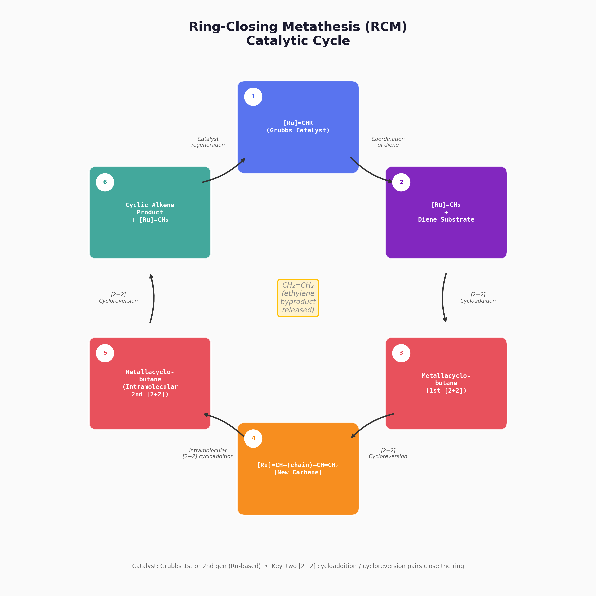

# Ring-Closing Metathesis (RCM)

**Detailed Explanation**  [PDF 版本](RCM_Ring_Closing_Metathesis_EN.pdf)

Compiled for Organic Chemistry Study — April 20, 2026

---

<video src="RCM.mp4" controls width="100%"></video>
[Video with detailed explaination](https://www.youtube.com/watch?v=tjLnbd3FGLk)

---

## Table of Contents

1. [Introduction](#1-introduction)
2. [Historical Background](#2-historical-background)
3. [The General Reaction](#3-the-general-reaction)
4. [Mechanism: The Chauvin Cycle](#4-mechanism-the-chauvin-cycle)
   - 4.1 [Step-by-Step Mechanism](#41-step-by-step-mechanism)
   - 4.2 [Catalytic Cycle Diagram](#42-catalytic-cycle-diagram)
5. [Common Catalysts](#5-common-catalysts)
6. [Ring Size and Selectivity](#6-ring-size-and-selectivity)
7. [Key Factors Affecting RCM](#7-key-factors-affecting-rcm)
8. [Representative Examples](#8-representative-examples)
   - 8.1 [Five-Membered Ring Formation](#81-five-membered-ring-formation)
   - 8.2 [Macrolactonization via RCM](#82-macrolactonization-via-rcm)
9. [Comparison with Related Metathesis Reactions](#9-comparison-with-related-metathesis-reactions)
10. [Applications](#10-applications)
11. [Limitations and Challenges](#11-limitations-and-challenges)
12. [Summary](#12-summary)

---

## 1. Introduction

**Ring-Closing Metathesis (RCM)** is an intramolecular olefin metathesis reaction in which a diene (a molecule with two carbon–carbon double bonds) is converted into a cyclic alkene, releasing a small olefin (typically ethylene, CH₂=CH₂) as a byproduct. RCM is one of the most powerful and widely used methods for constructing carbon–carbon double bonds within ring systems. It has revolutionized the synthesis of medium- and large-ring compounds, which are notoriously difficult to prepare by other methods.

The term *metathesis* comes from the Greek *metatithemi*, meaning "to transpose." In olefin metathesis, the substituents on two double bonds are formally exchanged ("transposed") through cleavage and re-formation of C=C bonds, mediated by a transition-metal carbene catalyst.

---

## 2. Historical Background

Olefin metathesis was first observed in the 1950s and 1960s in industrial polymer chemistry (e.g., the Phillips petroleum process). However, the mechanism remained a mystery until **Yves Chauvin** proposed the metal-carbene mechanism in 1971.

The development of well-defined, functional-group-tolerant catalysts by **Robert H. Grubbs** and **Richard R. Schrock** in the 1990s made RCM practical for organic synthesis. The three chemists were awarded the **2005 Nobel Prize in Chemistry** "for the development of the metathesis method in organic synthesis."

Key milestones:
- **1971** — Chauvin mechanism proposed.
- **1990** — Schrock's Mo-based alkylidene catalysts.
- **1992** — Grubbs' 1st-generation Ru catalyst (Grubbs I).
- **1999** — Grubbs' 2nd-generation catalyst (Grubbs II) with NHC ligand.
- **2000s** — Hoveyda–Grubbs catalysts and further developments.

---

## 3. The General Reaction

The general RCM transformation can be written as:

> **diene** —[M]=CHR catalyst, solvent, Δ→ **cyclic alkene** + CH₂=CH₂ ↑

The driving force is the **release of gaseous ethylene**, which escapes the reaction mixture (Le Chatelier's principle), shifting the equilibrium toward product formation.

Typical conditions: 1–10 mol% catalyst, **dilute** conditions (to favor intramolecular cyclization over intermolecular oligomerization), refluxing CH₂Cl₂ or toluene, under inert atmosphere (N₂ or Ar).

---

## 4. Mechanism: The Chauvin Cycle

The accepted mechanism for all olefin metathesis reactions (including RCM) is the **Chauvin mechanism**, which proceeds through a series of [2+2] cycloadditions and retro-[2+2] cycloreversions involving a **metallacyclobutane** intermediate.

### 4.1 Step-by-Step Mechanism

**Step 1: Coordination.** The metal carbene catalyst [M]=CHR coordinates to one of the two olefinic groups of the diene substrate.  
**Step 2: [2+2] Cycloaddition.** The metal carbene and the coordinated olefin undergo a [2+2] cycloaddition to form a four-membered **metallacyclobutane** ring. Although [2+2] cycloadditions are thermally forbidden for purely organic substrates (Woodward–Hoffmann rules), the d-orbitals of the metal make this process symmetry-allowed.  
**Step 3: Retro-[2+2] Cycloreversion.** The metallacyclobutane ring opens in the productive direction to release a small olefin (ethylene) and generate a **new metal carbene species** that is now tethered to the substrate.  
**Step 4: Intramolecular [2+2] Cycloaddition.** The new carbene, now part of the same molecule as the second double bond, undergoes a second [2+2] cycloaddition with the remaining olefin, forming a second metallacyclobutane — this time as part of the ring.  
**Step 5: Retro-[2+2] Cycloreversion (ring closure).** The second metallacyclobutane undergoes cycloreversion to release the **cyclic alkene product** and regenerate the metal carbene catalyst, completing the catalytic cycle.

### 4.2 Catalytic Cycle Diagram

```
                     + diene substrate
                              │
        ┌─────────────────────▼──────────────────────┐
        │                                            │
        │   [M]=CHR ──── [2+2] ────► Metallacyclo-   │
        │                  butane I       │          │
        │     ▲                           │          │
        │     │                           │          │
        │  retro-[2+2]               retro-[2+2]     │
        │  release product           −CH₂=CH₂        │
        │     │                           │          │
        │     │                           ▼          │
        │   Metallacyclo- ◄── intramol.  New [M]=CH– │
        │   butane II         [2+2]      (tethered)  │
        │                                            │
        └────────────────────────────────────────────┘
                              │
                              ▼
                        Cyclic alkene
```



---

## 5. Common Catalysts

The most commonly used RCM catalysts are ruthenium-based, prized for their air stability, functional group tolerance, and ease of handling compared to Schrock's early-transition-metal catalysts.

| Catalyst          | Metal | Ligand                  | Features                                      |
|-------------------|-------|-------------------------|-----------------------------------------------|
| Grubbs I          | Ru    | PCy₃ / PCy₃            | Good activity; air-stable; less reactive with sterically hindered substrates |
| Grubbs II         | Ru    | NHC (SIMes) / PCy₃     | Higher activity and stability; handles more challenging substrates |
| Hoveyda–Grubbs II | Ru    | NHC / chelating isopropoxybenzylidene | Recyclable; excellent thermal stability; good for electron-poor olefins |
| Schrock Mo        | Mo    | Imido / alkoxide       | Very high reactivity; sensitive to air and moisture; less functional-group tolerant |

NHC = N-heterocyclic carbene (typically SIMes = 1,3-bis(2,4,6-trimethylphenyl)-4,5-dihydroimidazol-2-ylidene).

---

## 6. Ring Size and Selectivity

RCM is most effective for forming **five-** and **six-membered rings**, which are thermodynamically and kinetically favored (low ring strain, favorable entropy).

- **5- and 6-membered rings**: Very facile; often proceed at room temperature with low catalyst loading (1–2 mol%).  
- **7- and 8-membered rings**: Moderate difficulty; may require higher temperatures, longer times, or higher catalyst loading.  
- **Medium rings (9–12)**: Challenging due to transannular strain and unfavorable entropy; require high dilution and sometimes specialized catalysts.  
- **Large rings (≥ 13)**: Macrocyclic RCM is possible and widely used in natural product synthesis, but requires very high dilution (typically ≤ 1 mM substrate concentration).

The competition between intramolecular RCM and intermolecular acyclic diene metathesis polymerization (ADMET) is controlled by **dilution**: lower concentration favors RCM.

---

## 7. Key Factors Affecting RCM

1. **Thorpe–Ingold effect (gem-disubstitution effect).** Having substituents on the carbon chain connecting the two olefins brings the reactive ends closer together, accelerating cyclization. This conformational effect is often exploited deliberately.  
2. **Olefin substitution pattern.** Terminal olefins (monosubstituted) react fastest. Disubstituted olefins are slower but still feasible. Trisubstituted olefins are challenging and require highly active catalysts (e.g., Grubbs II or Hoveyda–Grubbs II).  
3. **Functional group compatibility.** Ruthenium catalysts tolerate alcohols, esters, amides, ethers, and even some amines and thiols. However, free amines, thiols, and phosphines can coordinate to the metal and poison the catalyst. *Protection* of these groups (e.g., Boc for amines) is common.  
4. **Concentration.** High dilution (~1–10 mM) favors RCM over oligomerization. Slow addition of substrate (*syringe pump*) is also used.  
5. **Temperature.** Refluxing CH₂Cl₂ (~40 °C) or toluene (~110 °C) is typical. Higher temperatures increase catalyst activity but may also accelerate decomposition.  
6. **Ethylene removal.** Removing ethylene (by inert gas sparging or reduced pressure) drives the equilibrium forward.

---

## 8. Representative Examples

[More Examples](RCM_Detailed_Guide.pdf)

### 8.1 Five-Membered Ring Formation

One of the simplest demonstrations of RCM is the cyclization of diallyl ether to form 2,5-dihydrofuran:

> CH₂=CH–CH₂–O–CH₂–CH=CH₂ —Grubbs I, CH₂Cl₂→ **2,5-dihydrofuran** + CH₂=CH₂ ↑

This reaction proceeds quantitatively at room temperature within minutes, illustrating the ease of 5-membered ring closure.

### 8.2 Macrolactonization via RCM

Many biologically active natural products contain macrocyclic lactones (macrolides). RCM has been used in landmark total syntheses such as:
- **Epothilone A & B** — 16-membered macrolide anticancer agents.  
- **Sch 38516 (fluvirucinin A₁)** — 14-membered ring closure by RCM.  
- **Stemonamide** — a complex alkaloid synthesized using RCM as a key step.

In these syntheses, the RCM step typically requires high dilution (< 1 mM) and Grubbs II or Hoveyda–Grubbs II catalyst.

---

## 9. Comparison with Related Metathesis Reactions

| Reaction Type          | Substrates                  | Products                     | Notes                                      |
|------------------------|-----------------------------|------------------------------|--------------------------------------------|
| **RCM**                | Diene (intramolecular)      | Cyclic alkene + CH₂=CH₂     | Ring formation; dilute conditions          |
| **CM**                 | Two olefins (intermolecular)| New olefin                   | E/Z selectivity can be challenging         |
| **ROM**                | Cyclic olefin               | Diene or oligomer            | Driven by ring strain release              |
| **ROMP**               | Strained cyclic olefin      | Polymer                      | Norbornene, cyclooctene, etc.              |
| **ADMET**              | α,ω-diene (intermolecular)  | Linear polymer + CH₂=CH₂    | Competes with RCM                          |

---

## 10. Applications

1. **Total Synthesis of Natural Products.** RCM is a go-to strategy for constructing macrocyclic frameworks found in bioactive molecules (macrolides, cyclopeptides, terpenes).  
2. **Pharmaceutical Chemistry.** Several FDA-approved drugs and clinical candidates feature ring systems formed by RCM, including **simeprevir** (Hepatitis C protease inhibitor) and **BILN 2061**.  
3. **Materials Science.** ROMP (the polymer counterpart) produces specialty polymers, but RCM itself is used in monomer synthesis.  
4. **Green Chemistry.** Metathesis can replace multi-step sequences, improving atom economy. Ethylene is the only byproduct.  
5. **Bioconjugation & Chemical Biology.** RCM has been used to "staple" α-helical peptides, reinforcing their secondary structure for therapeutic applications.

---

## 11. Limitations and Challenges

- **E/Z selectivity.** Standard RCM gives mixtures of E and Z isomers. Z-selective catalysts (e.g., by Grubbs and Hoveyda) have been developed but are still substrate-dependent.  
- **Catalyst decomposition.** Ru catalysts can decompose at high temperatures or in the presence of certain functional groups. Ruthenium residues can be difficult to remove.  
- **Substrate limitations.** Electron-poor olefins (e.g., α,β-unsaturated carbonyls) and very hindered olefins are sluggish.  
- **Medium ring difficulty.** Rings of 8–12 members remain challenging targets.  
- **Ruthenium removal.** Trace Ru in pharmaceutical products is a regulatory concern. Scavengers (e.g., activated carbon, DMSO, lead tetraacetate) or silica chromatography are used.

---

## 12. Summary

**Key Takeaways**  
1. RCM converts a diene into a cyclic alkene + ethylene, catalyzed by metal carbenes.  
2. The mechanism follows the Chauvin cycle: alternating [2+2] and retro-[2+2] steps via metallacyclobutane intermediates.  
3. Grubbs-type Ru catalysts are the workhorses due to their stability and functional group tolerance.  
4. Ring size, dilution, olefin substitution, and the Thorpe–Ingold effect are critical for success.  
5. RCM is indispensable in modern organic synthesis, from natural products to pharmaceuticals.
